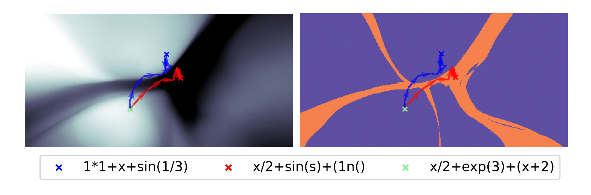

# Mitigating over-exploration in latent space optimization using LES

### [Arxiv link](https://arxiv.org/abs/2406.09657)



This repository contains the implementation of the paper Mitigating over-exploration in latent space optimization using LES, by Omer Ronen, Ahmed Imtiaz Humayun, Richard Baraniuk, Randall Balestriero and Bin Yu.

<details><summary><b>Citation</b></summary>

If you use LES or any of the resources in this repo in your work, please use the following citation:

```bibtex
@misc{ronen2025mitigatingoverexplorationlatentspace,
      title={Mitigating over-exploration in latent space optimization using LES}, 
      author={Omer Ronen and Ahmed Imtiaz Humayun and Richard Baraniuk and Randall Balestriero and Bin Yu},
      year={2025},
      eprint={2406.09657},
      archivePrefix={arXiv},
      primaryClass={cs.LG},
      url={https://arxiv.org/abs/2406.09657}, 
}
```

</details>

<details open><summary><b>Table of contents</b></summary>

- [Environment setup](#environment)
- [Datasets and models](#datasets)
- [Replication of results](#rep)
    - [Valid generation](#valid)
    - [Bayesian Optimization](#BO)
- [Calculating LES](#les)
- [License](#license)

</details>

### Environment setup  <a name="environment"></a>

Using [Anaconda](https://docs.anaconda.com/anaconda/install/index.html), first clone the current repository:
```bash
git clone https://github.com/OmerRonen/les.git
```
Then install the dependencies using:
```bash
conda env create --file environment.yml
conda activate les
```
To use the [log-expected improvement acquisition function](https://arxiv.org/abs/2310.20708), you would have to manually clone and install the [BoTorch](https://github.com/pytorch/botorch) repository:
```bash
git clone https://github.com/pytorch/botorch.git
cd botorch
pip install -e .
```

### Datasets and models  <a name="datasets"></a>

#### Datasets
This repository uses the expressions and SMILES datasets, both can be downloaded from the [repository](https://github.com/mkusner/grammarVAE/) of the [Grammar Variational Autoencoder](https://arxiv.org/abs/1703.01925) paper. Specifically, the `eq2_grammar_dataset.h5` and `250k_rndm_zinc_drugs_clean.smi` files should be downloaded into the `data/grammar` and `data/molecules` directories, respectively.

#### Models
All the models used in our work can be found in the `trained_models` directory. The following command loads a pre-trained VAE for the expressions dataset:

```python
from les.nets.utils import get_vae
from les.utils.les import LES
dataset = "expressions"
architecture = "gru"
beta = "1"
vae, _ = get_vae(dataset=dataset, architecture=architecture, beta=beta)
```

### Replication of results  <a name="rep"></a>

For replicating the results on the molecular datasets (SELFIES and SMILES), we recommend using a GPU to avoid long running times.


#### Valid generation <a name="valid"></a>
The results in Table 1 can be replicated using:
```bash
python -m les.analysis.ood <DATASET> <ARCHITECTURE> <BETA>
```

where `<DATASET>` should be replaced with `expressions`, `smiles`, or `selfies`, `<ARCHITECTURE>` with `gru`, `lstm`, or `transformer` and `<BETA>` with `0.05`, `0.1` or `1`.

#### Bayesian Optimization <a name="BO"></a>
The Bayesian Optimization results in Section 4 can be replicated using the following CLI (see help for more details):
```bash
python -m les.analysis.bo
```

### Calculating LES  <a name="les"></a>
If you are interested in calculating ScaLES with a given pre-trained generative model, you can use the following code:

```python
from les.nets.utils import get_vae
from les.utils.les import LES
dataset = "expressions"
architecture = "gru"
beta = "1"
vae, _ = get_vae(dataset=dataset, architecture=architecture, beta=beta)
les = LES(vae)
z = torch.randn((5, vae.latent_dim))
les_score = les(z)
```

### License <a name="license"></a>

The code is released under the MIT license; see the [LICENSE](LICENSE) file for details.